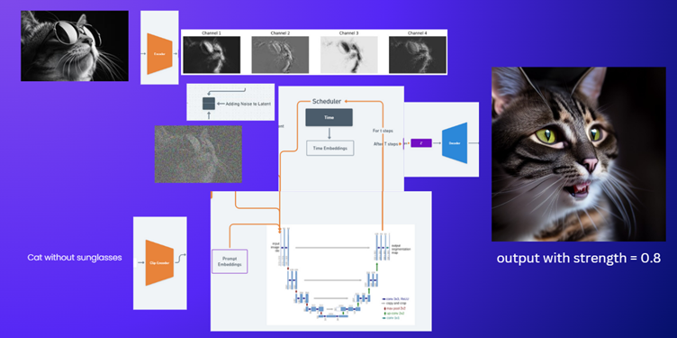

# Diffusion from scratch
Making Diffusion from scratch submodel by submodel!
This project focuses on re-implementing Stable Diffusion using a custom architecture with a **Variational Autoencoder (VAE)**, **CLIP Encoder**, and a **U-Net** for step-by-step denoising of images based on prompts. A scheduler guides the denoising process.

---

## **Architecture and Workflow**

The results shown in the image above are generated using [pre-trained weights from hugging face](https://huggingface.co/stable-diffusion-v1-5/stable-diffusion-v1-5/blob/main/v1-5-pruned-emaonly.ckpt). 
These are **not** the results of our custom-trained models.

---

## **Training Process and Loss Functions**

Our training pipeline follows the diffusion process as described in the original paper. We use two primary losses, which encapsulate the core denoising process. While the paper describes additional losses, they are variations of the following fundamental losses:
**1. Forward Trajectory (Adding Noise)**

We progressively add noise to the input image $X_0$ through time steps $x_1, x_2, \dots, x_t$ until reaching pure noise $x_t$. The process is defined as:

$q(x_t | x_{t-1}) = \mathcal{N}(x_t ; \sqrt{1 - \beta_t} \cdot x_{t-1}, \beta_t \cdot I)$

**Key Terms:**

* $q$: Distribution of the noisy state.
* $x_t$: Image at step $t$ with added noise.
* $x_{t-1}$: Image at step $t-1$ with less noise.
* $\mathcal{N}$: Gaussian distribution.
* $\beta_t$: Noise decay factor. A higher $\beta_t$ adds more noise.

**2. Reverse Trajectory (Removing Noise)**

The denoising process reconstructs the clean image $X_0$ from pure noise $x_t$, moving backward through $x_t, x_{t-1}, \dots, x_1$:

$x_{t-1} \sim \mathcal{N}(U_t(x_t), \beta_t \cdot I)$

**Key Terms:**

* $U_t(x_t)$: Model's prediction of the clean data based on the noisy input $x_t$.
* $\beta_t \cdot I$: Variance for randomness, ensuring diversity in reconstructions.

Where:

$U_t(x_t) = \frac{1}{\sqrt{1 - \beta_t}} \cdot \left( x_t - \frac{\beta_t}{\sqrt{1 - \beta_t}} \cdot \epsilon_\theta(x_t, t) \right)$

* $\epsilon_\theta(x_t, t)$: Predicted noise by the model.

## **Current Progress**
1. **Components Implemented**:
   - Forward and reverse trajectories for noise addition and removal.
   - Loss functions based on diffusion model principles.
2. **Trained Models Used**:
   - **VAE**: [VAE Re-implementation](https://github.com/bit-soham/VAE)
   - **CLIP Encoder**: [Clip-Encoder Re-implementation](https://github.com/theSohamTUmbare/CLIP-model).
3. **Diffusion Model Training**:
   - Currently in progress, with the aim to achieve competitive results.

---

## **Future Goals**
- Complete the training of our diffusion model.
- Experiment with novel loss functions and scheduler improvements.
- Benchmark our results against the pre-trained model's performance.

---

## **Project Report**
For more details, check out our **[project report](https://publuu.com/flip-book/761505/1690317)**.

